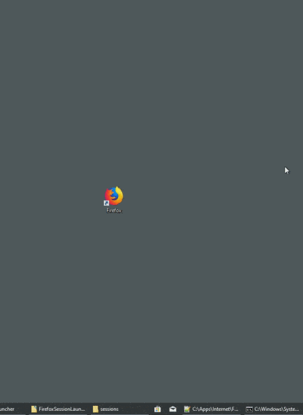

# SessionLauncher

*NOTE: Readme is pretty rough. I probably missed something important. If there's any public interest in the project, I'll polish things up.*

Session Manager for classic Firefox hasn't been properly replicated, 'Tab Session Manager' is close but has some serious issues - likely because the same capability simply cannot be done via WebExtensions.

So out of sheer frustration with Waterfox + Session Manager suffering from bitrot and performance issues, I decided to finally migrate to Firefox and just make myself the one thing that was missing - and so SessionLauncher was born.

Leveraging the awesome power of Windows Batch and Internet Explorer HTA's (*cough*), I have made this Windows-only (sad-face) launcher that, by hooking the Firefox (ESR recommended) config.js system, provides a GUI to launch a specific session by swapping files around early in the Firefox profile load (before the session is even read, thankfully). The end result is a single profile in Firefox still - sharing all data - except for the "session" (current tabs) which are provided by the launcher.

In case it wasn't obvious - there is no need to ever manually save the session. Just ensure "Load last tabs" option is set in Firefox, and the Session Launcher will take care of the rest.

## Demo

## Installation

NB: Firefox ESR is recommended rather than mainline releases as I have no idea if/when Mozilla will deprecate any of the stuff that SessionLauncher requires. Note that it does NOT require sandboxing to be disabled - it doesn't actually touch config at all, just leverages the same "hook" - so I don't believe there are any security concerns regarding SessionLauncher.

IMPORTANT: Requires user symlink permission, or running as administrator. Windows 10 Pro only AFAIK - done in secpol.msc

To install, just download this repo, copy the contents of copy-to-Firefox-install-dir to your Firefox install directory, and run Firefox! A _Default profile will be created on first launch - this cannot be renamed or deleted and always appears at the top as a fallback. (Note that you can always edit the scripts yourself if you really want to change the _Default name).
